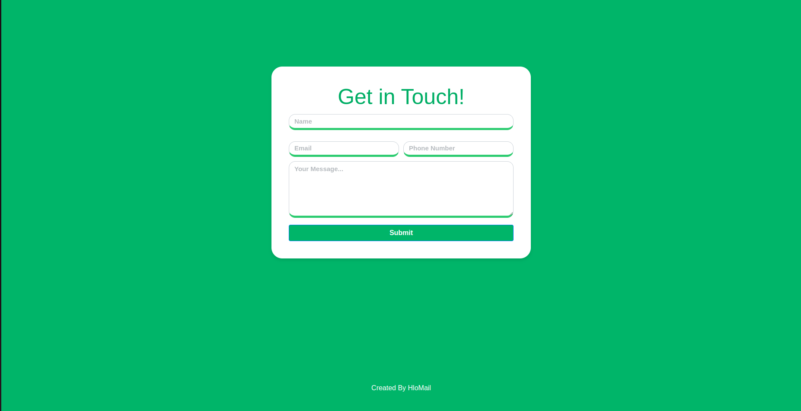

# HloMail Contact Page

This is the contact page for HloMail, providing a simple and elegant way for users to get in touch. It features a responsive design using Bootstrap, a clean and modern user interface, and a contact form with input fields for name, email, phone number, and message.

## Features

- Responsive design for all devices
- Clean and modern user interface
- Contact form with input fields for name, email, phone number, and message
- Form validation for required fields
- Footer with a link to the HloMail website

## Technologies Used

- HTML5
- CSS3
- Bootstrap 5

## Bootstrap Advantages

1. **Responsive Grid System**: Ensures the page looks great on all devices by utilizing Bootstrap's responsive grid system.
2. **Pre-styled Components**: Utilizes Bootstrap's pre-styled form controls, buttons, and other components for a consistent look and feel.
3. **Customizable**: Easy to override styles or add custom styles to achieve a unique design.
4. **Extensive Documentation**: Bootstrap's extensive documentation makes it easy to implement and troubleshoot.
5. **Cross-browser Compatibility**: Bootstrap is designed to work seamlessly across different browsers.

## How to Use

1. Clone the repository
2. Open `index.html` in your browser
3. Fill out the form and submit (Note: form submission logic not included)

## Customization

The page uses Bootstrap classes for layout and styling, making it easy to customize the design. Here are a few customization options:

1. **Colors**: Modify the background colors (`#00B569`) and text colors in the CSS styles to match your brand or design preference.
2. **Font Styles**: Change the font family, sizes, and styles for headings, form labels, and other text elements.
3. **Form Styles**: Adjust the styles for form inputs, such as border styles, border colors, and placeholder text opacity.
4. **Button Styles**: Customize the appearance of the submit button by modifying the `btn-primary` class or adding your own custom button styles.
5. **Responsive Behavior**: Adjust the media query breakpoints and styles to fine-tune the responsive behavior for different screen sizes.

## Created By

This contact page was created by [HloMail](https://hlomail.in).
