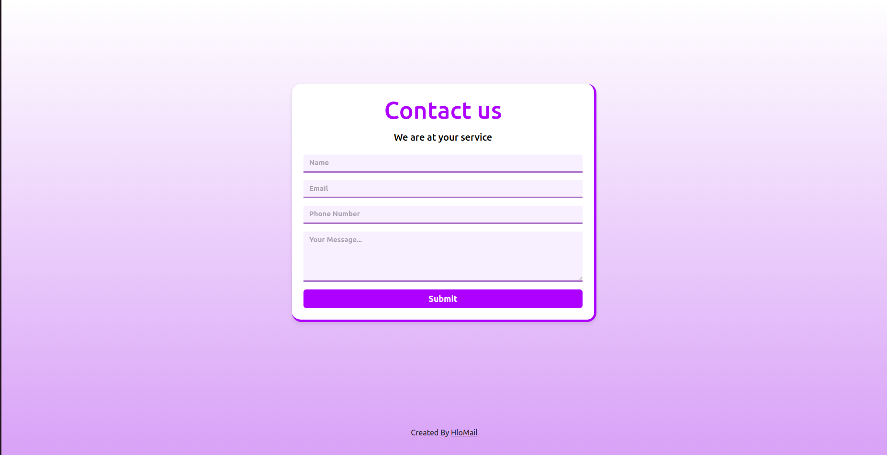

# HloMail Contact Page

This is the contact page for HloMail, a web application that provides a simple and elegant way for users to get in touch with the company or its representatives.

## Features

- Responsive design using Bootstrap 5, ensuring the page looks great on all devices, including desktops, tablets, and mobile phones.
- Clean and modern user interface with a visually appealing gradient background and a sleek contact form design.
- Custom styled headings with an underline effect, adding a unique touch to the page's aesthetics.
- Form validation for required fields, ensuring that users provide the necessary information before submitting the form.

## Technologies Used

- HTML5: The markup language used for structuring the page content.
- CSS3: The styling language used for designing the page layout and visual elements.
- Bootstrap 5.3.0: The popular front-end framework used for creating responsive and mobile-first web applications.

## Bootstrap Advantages

1. **Responsive Grid System**: Bootstrap's grid system ensures that the page layout adapts seamlessly to various screen sizes and devices.
2. **Pre-styled Components**: The framework provides pre-styled form controls, buttons, and other components, ensuring a consistent look and feel across different pages and components.
3. **Customizable**: Bootstrap's styles can be easily overridden or extended to create a unique design that aligns with the brand's identity.
4. **Extensive Documentation**: The framework is well-documented, making it easier for developers to implement and troubleshoot any issues that may arise.
5. **Cross-browser Compatibility**: Bootstrap's codebase is optimized for cross-browser compatibility, ensuring that the page renders correctly across different web browsers.

## Page Structure

1. **Header**: An attractive title with a custom underline effect, immediately capturing the user's attention and setting the tone for the page.

2. **Contact Form**:
  - Full Name input: Allows users to provide their full name.
  - Email input with icon: Enables users to enter their email address, with a subtle icon for visual enhancement.
  - Message textarea: Provides a larger text area for users to write their message or inquiry.
  - Submit button: A prominent button for users to submit their form after filling in the required fields.

3. **Footer**: A simple footer with credits and a link to the HloMail website, acknowledging the creator of the page.

## How to Use

1. Clone the repository containing the contact page files.
2. Open the `index.html` file in your preferred web browser.
3. Fill out the form by providing your name, email address, and message.
4. Click the "Submit" button to submit the form (Note: The form submission logic is not included in this code snippet, and you may need to implement it based on your specific requirements).

## Customization

The contact page utilizes custom CSS for the underline effect on the headings and Bootstrap for the overall styling and layout. To customize the page, follow these steps:

1. Modify the `.contact-form h1` and `.contact-form h2` classes in the `<style>` tag to adjust the heading styles, including font size, color, and underline effect.
2. Update the Bootstrap classes used on the HTML elements to change the layout or styling of various components, such as the form inputs, buttons, or container dimensions.
3. Adjust the `<form>` element by modifying the `action` attribute to specify the desired URL or backend logic for form submission.

## Created By

This contact page was created by [HloMail](https://nexrof.in)
