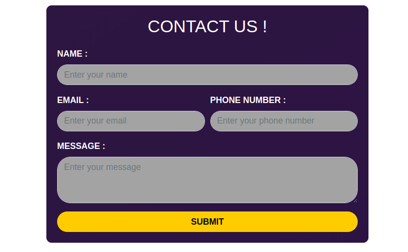

# HloMail Contact Page

This is the contact page for HloMail, providing a simple and elegant way for users to get in touch.

## Features

- Responsive design using Bootstrap 4.5.2
- Clean and modern user interface with gradient background
- Custom styled form with rounded input fields
- Mobile-friendly layout

## Technologies Used

- HTML5
- CSS3
- Bootstrap 4.5.2
- jQuery 3.5.1
- Popper.js 1.16.0

## Page Structure

1. **Contact Form**: 
   - Name input
   - Email input
   - Phone number input
   - Message textarea
   - Submit button
2. **Footer**: Credits to HloMail

## Styling

The page uses custom CSS for a unique design:

- Gradient background for the form container
- Semi-transparent overlay for better text readability
- Custom styling for form inputs and submit button

## How to Use

1. Clone the repository
2. Open `index.html` in your browser
3. Fill out the form and submit (Note: form submission logic not included)

## Customization

To customize the page:

1. Modify the CSS in the `<style>` tag for layout and color changes
2. Update Bootstrap classes in HTML elements for layout adjustments
3. Add form submission logic to the `<form>` element

## Bootstrap Advantages

1. **Responsive Grid System**: Ensures the page looks great on all devices
2. **Pre-styled Components**: Utilizes Bootstrap's form controls for consistent look and feel
3. **Customizable**: Easy to override styles for a unique design
4. **Cross-browser Compatibility**: Works seamlessly across different browsers

## Dependencies

- Bootstrap CSS: `https://maxcdn.bootstrapcdn.com/bootstrap/4.5.2/css/bootstrap.min.css`
- jQuery: `https://ajax.googleapis.com/ajax/libs/jquery/3.5.1/jquery.min.js`
- Popper.js: `https://cdnjs.cloudflare.com/ajax/libs/popper.js/1.16.0/umd/popper.min.js`
- Bootstrap JS: `https://maxcdn.bootstrapcdn.com/bootstrap/4.5.2/js/bootstrap.min.js`

## Created By

This contact page was created by HloMail.
